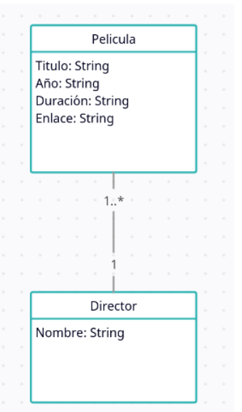

# Scraping - Extracción de Datos de IMDb

Este proyecto utiliza Selenium para extraer datos sobre las películas mejor valoradas en IMDb.

## Requisitos

- Java 8 o superior
- WebDriver para Firefox (geckodriver)

## Configuración

1. Clona el repositorio:

```bash
git clone https://github.com/tu_usuario/tu_proyecto.git
cd tu_proyecto

## Ejecución

    Ejecuta la clase Main ubicada en src/main/java/nombre/paquete/Main.java.

    El programa abrirá Firefox, accederá a la página web de IMDb y extraerá datos de las películas.

Estrategia Utilizada

El proyecto utiliza Selenium para la automatización del navegador. Se realiza la extracción de datos de las películas mejor valoradas en IMDb, incluyendo título, enlace, año y duración. Además, se recopila información sobre los directores.
Estructura del Proyecto

    src/main/java/nombre/paquete/: Contiene los archivos fuente Java.
    src/main/resources/: Ubicación del controlador de Firefox (geckodriver).
    peliculas.csv: Archivo CSV con información sobre las películas.
    directores.csv: Archivo CSV con información sobre los directores.
    peliculas.xml: Archivo XML con información sobre las películas.


Autor
Rabab Beihaqi

Diagrma de clases

